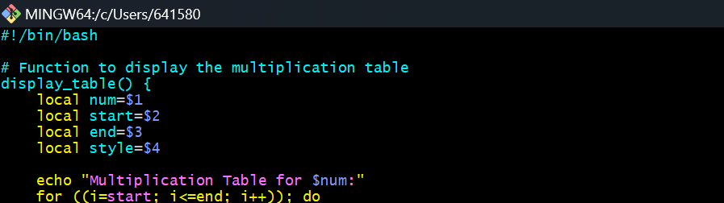
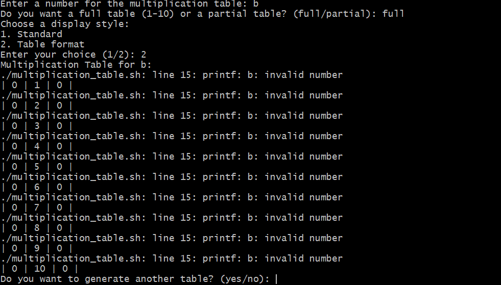
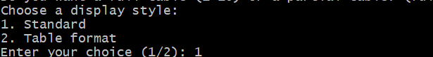
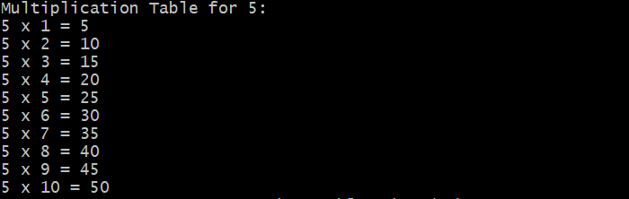
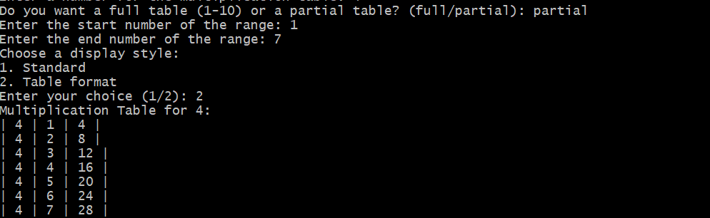

# __Capstone Project - Linux Shell Scripting__

# __Capstone Project: Bash Script For Generating a Multiplication Table__

# Project Objective:
# To create a bash script that generates a multiplication table for a number entered by the user

# Step 1: User Input for Number

# In this step, I Created the bash scripts using functions, loops and conditional logic as seen in the image below to prompt the user to input a number for which the multiplication table will be generated. The images below shows the script and the output

# Step 2: Choice of Table Range

# I implemented this step using loops and conditional logic to ask the user if they want a full multiplaction table (1-10) or a partial table, if they choose a partial table, the next step was to prompt them for the start and end of the range. This steps are seen in the images below.

# Step 3: Input Validation

# In this step, I validated the input using conditional statements and provided feedback for invalid input as show in the images below

# Step 4: Generate and Display The Multiplication Table According to The Specified Range

# After validation of the inputs, the next step was to prompt the user for a display style (standard or table format) after which the multiplication table will be displayed according to the specified style and range as shown in the images below.

# Step 5: Provide Clear Output Formatting For Ease of Reading

# This step talks about the clarity and readability of my output and this can be seen in the images below.

# Step 6: Enhanced User Interaction:

# In this step, I incorporated additional checks or features such as repeating the program for another number without restarting the script as shown in the images below.

# Step 7: Creative Display Options: 

# In this step, I offered different formatting styles for the table display, prompting the user to make their choice as seen in the images below.

